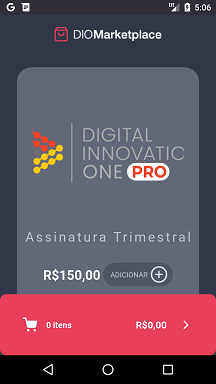
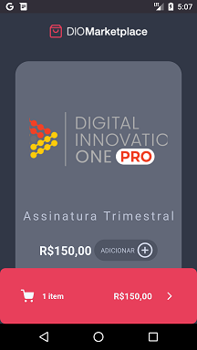
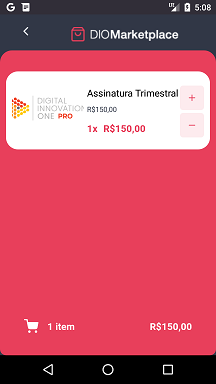

# DIOMarketPlace
Projeto desenvolvido no Curso "Desenvolvendo aplicativos móveis com Redux e React Native" da [Digital Innovation One](https://digitalinnovation.one).

Este aplicativo apresenta um catálogo de produtos de assinatura que podem ser adicionados ao carrinho de compras. O carrinho de compras, por sua vez, permite alterar a quantidade de produtos ou remover os produtos.

Para montar a interface do catálogo, o aplicativo faz requisições a uma API fake criada com o JSON Server.

## Instruções
Depois de obter o projeto na sua máquina local, abra uma janela de linha de comandos do sistema e acesse o diretório do projeto.

Instale as dependências do projeto:
```bash
yarn
```

Caso não tenha instalado o JSON Server, instale-o globalmente no seu computador:
```bash
yarn add global json-server
```


Para criar a API fake, inicie o JSON Server:
```bash
json-server server.json
```

Em outra janela de linha de comandos, acesse novamente o diretório do projeto e inicie o Metro Server:
```bash
yarn start
```

Em seguida, abra outra janela de linha de comandos e, dentro do diretório do projeto, inicie a aplicação:
```bash
yarn android
```
**Obs:** Para o ios, execute `yarn ios`.

## Principais bibliotecas e dependências de projeto
- React Native
- React Navigation
- React Redux
- Redux Saga
- Axios
- Styled Components
- Lottie React Native

## Screenshots



